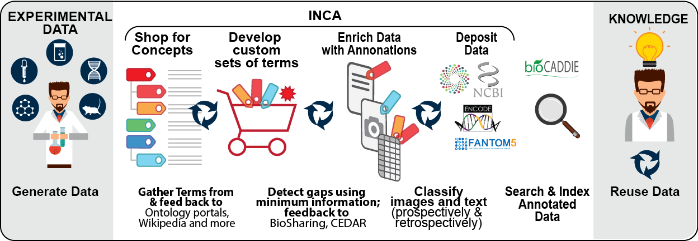

# INCA: Intelligent Concept Assistant

INCA is a [BD2K funded project](https://commonfund.nih.gov/bd2k/fundedresearch) to develop an
environment for helping scientists to collaboratively create, extend
and apply their knowledge to describe and interpret biomedical
datasets.

interested in working on this project? __we're hiring__: http://bit.ly/posting-inca

To follow updates on the project once we get started, subscribe to [this ticket](https://github.com/INCATools/intelligent-concept-assistant/issues/1)

